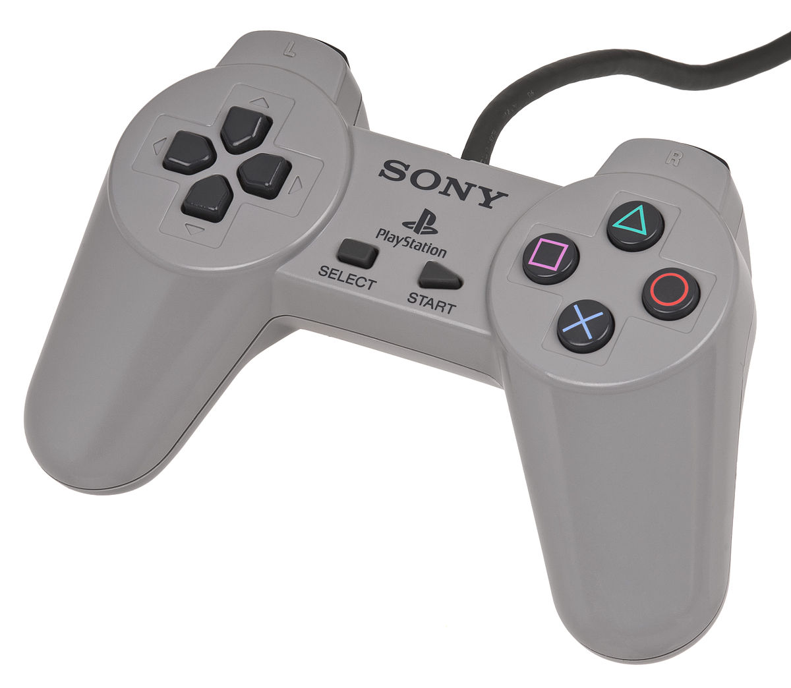

# 1.3 Research

## **Final Fantasy VII**

### Overview

Final Fantasy VII is a very popular Turn based Role Playing Game and a part a long line of games in the Final Fanatsy name, It was developed by Square Enix. Only playable on the original playstation, It is mainly a story based game with the combat being turn based and was a huge success in pushing the RPG genre into the western world. The game is PEGI 12 rated.

### Controls

This controller compared to its future versions doesnt have the analog stick to move around ; it was only the D-Pad on the left of the controller which was far more restrictive, It would also be used for scrolling through the fight menu, inventory etc.

### Story and World

The game follows the main character called Cloud Strife, a mercernary who has to try and stop a a tyrannical mega corporation that controls the world. You are also joined by an organization filled with a variety of characters you can also plays as

The UI is clear with how it presents info regarding characters such as characters Health, Level and Magic. The Inventory is also clear easy to get to, view items you have and using specific items on characters like elixirs.The Turn based combat UI is also very easy to navigate and is very iconic in the sense that it popularised this layout being used for future turn based games.

### Features



| Feature              | Justification                                                                                                                                                                        |
| -------------------- | ------------------------------------------------------------------------------------------------------------------------------------------------------------------------------------ |
| Stats                | These stats will include Strength, Vitality, Special(or magic), the player will be able to upgrade these stats everytime they level up                                               |
| Fight menu           | It displays character moves, Health and  order the charcters will be attacking in succesfully                                                                                        |
| Character menu       | I would include this becuase it is easy to navigate, displays information effectively and the use of blue is not too bright but also too dark so the user can see it without trouble |
| Other party members  | Having a decent variety of party members not only gives the player a freedom of choice but also fleshes the game out more                                                            |
| Inventory menu       | The inventory is simple, easy to get and using items is swift.                                                                                                                       |



| Feature      | Justification                                                                           |
| ------------ | --------------------------------------------------------------------------------------- |
|              |                                                                                         |
| 3D graphics  | Not only would it take a large amount of time to make but also it would be unrealistic  |



## Pokemon (Generation 1)

 (1) (1).png>)

### Overview

Pokemon is an incredibly succesful franchise with a long line of games spanning from 1996 to today.The game was developed by GameFreak and published by Nintendo on the gameboy and incredibly popularised the console and the Pokemon Franchise.The game is a PEGI 12 rating

### Controls

 (1).png>)

The gameboy was quite revolutionary for its time as it was easy to handle and consumers are able to take it everywhere. The way to navigate across different areas, Inventorys and menus is using the directional pad on the left. A and B where used by allowing you to either choose or back away from a certain action respectively.

### Story and World

The main objective of the game is to catch all 151 pokemon and become a pokemon champion by defeating the Elite Four. The way you do this is by catching pokemon of your liking and level them up, The pokemon themselves have a variety of moves, typings, weaknesses and strengths which all culminate into a fun and enjoyable experience.

The UI used is basic but effective enough for the consumer to have an easy experience playing the game. Viewing pokemons health ,stats and lvl is also quite easily accessible, although there really isnt anything like colour to make it stand out but this was 1996 and tech like that wasnt available yet.



| Feature            | Justification                                                                                                                                                                        |   |
| ------------------ | ------------------------------------------------------------------------------------------------------------------------------------------------------------------------------------ | - |
| Random Encounters  | Random encounters give an element of surprise and also demands the players constant attention. This is one way the player will be able to level up                                   |   |
| Levelling up       | Allowing the player to level up through fights and get stronger with each fightr gives the player a sense of progression and the players efforts into getting stronger are rewarded. |   |
| Pixelated graphics | The simple pixelated graphics are not only easy enough to do but also could spark some nostalgia in players.                                                                         |   |



| Feature           | Justification                                                                     |   |
| ----------------- | --------------------------------------------------------------------------------- | - |
| Catching pokemon  |  Actually catching pokemon and making them fight for you will not be in the game  |   |
|                   |                                                                                   |   |



## Undertale

 (1).png>)

### Overview

Undertale is a Role-playing game made in 2015 by an indie developer by the name of Toby Fox, despite being only an indie game with a small budget it was incredibly succesful due to its humor, story and likable characters. It garnered a passionate fandom and was the subject to a lot of memes which only popularised it even more. Its PEGI rating is 12.

### Controls

&#x20;

The Default controls for undertale are arrow keys to move. Z,X,C to interact but you are able rebind these keys to whatever you find comfortable.

### Story World and Design

In Undertale, you follow the story of a child whos fallen into the underground which is filled with a plethora of Unique and interesting monsters a lot of which you become friends with. The game was also popular because of its three different paths of playthroughs which are pacifist, neutral and genocide.Allowing the player the freedom of choice on what ending they would like definately helps along with the smarmy humour and likable charcters. The game also had a tendency to break the 4th wall which definately added to the popularity of this game.



| Features            | Justification                                                                                                                                                   |   |
| ------------------- | --------------------------------------------------------------------------------------------------------------------------------------------------------------- | - |
| Humour and writing  | The humour and writing in this game is very likeable whhich lends to its appeal so i thought implementing this into the game will help it become more appealing |   |
| Save game           | Giving players this feature allows them a sense of relief.It also allows them to stop playing the game and come back to the same spot                           |   |
| Level design        | The level design of this game arent really focused on platforming but just to navigate from one place to another which is what I want to do.                    |   |



| Feature                 | Justification                                                                        |   |
| ----------------------- | ------------------------------------------------------------------------------------ | - |
| Three different endings | I feel like this would take too long to implement and keeping linear would be better |   |
|                         |                                                                                      |   |


