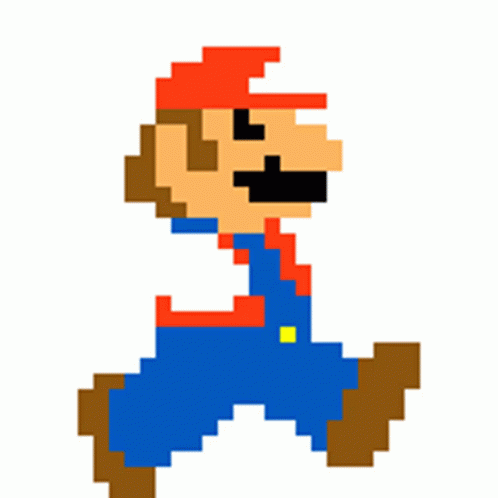
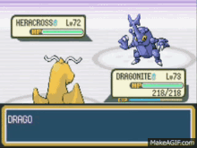
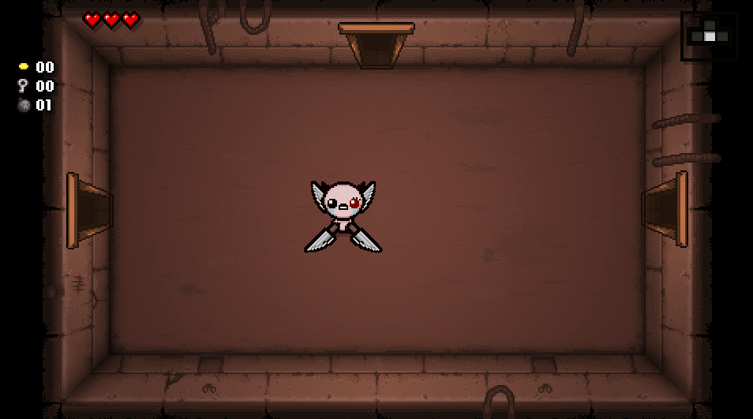

# 1.4a Features of Proposed Solution

## Mechanics

### Movement

The character the player will be controlling will be able to move around with a set speed, the player will also be able to make the character stop as soon as they let go of the key. A physics engine will also be implemented so the character is able to jump and fall back down, also when the character runs and jumps it increases the height of the jump

### Collisions

Collisions will allow the character to stay on specific platforms and when the player hits an obstacle it will collide and stop them from passing through depending on what they collide with.

### Controls

The controls for this game are going to be simple and easy to learn.They are A,D  to move left and right respesctively, to jump would be spacebar to allow for ease and enough control in the game. To move around in the fight menu the Arrow keys will be used because it is convenient and easy to understand

## Level Layout

Levels will not be oriented on platforming but rather just to focus on moving around as smoothly as possible so the player can enter fights with enemies more often. The player will be able to move and  jump around. A physics engine will and collison detection will prevent the player from falling throught the game

### Camera centered on player

The camera will mostly if not always be centered on the player when moving around freely outside the fights. When a player enters the fight the layout and camera will be adjusted so that the enenmie and player is seen properly&#x20;

### Enemies&#x20;

They will be a major part of the game ; the enemies will be a way for the player to gain Experience points and be able to make the characters stronger, the player will also have a chance to gain valuable or invaluable items depending on RNG(Random Number Generator). Enemies will also vary quite a bit depending on what area of the game you are at so the enemies in that are will scale with what level your charcter is at.

### Items&#x20;

Items will be obtainable through either fighting enemies or finding them on the ground, some items will be rarer than other and the rarity depends on how good the item is and what it does, for example an item that only boosts attack wont be as rare and valuable as an item which boosts attack and speed.

### Secret locations

There will be secret locations in the game that grant the player more valuable items so that the player is rewarded for there exploration and patience which in turn leads to better items.&#x20;

### NPC

I plan for the game to have NPC's which i plan to give dialogue either to indirectly/directly help the player or for humourous dialogue

## &#x20;  Graphics and User Interface

### Design

&#x20;                                                                                                                         &#x20;

I would like to uise a pixelated art style for the game and the level design to be similar to Binding of Isaac.The pixelated art style would not only make the game look more inviting and fun b ut also might be nostalgic for anyone who played older games.&#x20;

### UI

I plan to have a start screen in my game where the player is able to select a few levels, when in the actual game there will be a health bar and a item count which when clicked on will have a screen you are able to scroll through items you have found.                                                                                                                                               &#x20;

## Limitations

### Accessability

The only platforms this game will be centered around and made for is primarily keyboard and mouse for a Pc so it will not support touchpads controllers etc. I want to focus on one rather than proritising a larger audience&#x20;

### Graphics&#x20;

The graphics for the game will not be completely prioritised and advanced as im making the game on a pretty limited toolset when it comes to amazing graphic and animation so it will mostly be pixelated.

### Performance

The performance for the game wll most likely be running at 30 fps as i do not have the equipment nor time to make anything better,it will also be limited by the facte it is going to be web based.

