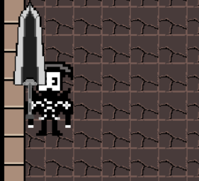

# 3.2 Usability Testing

## Criteria To Assess

To accurately assess the usability of the game, There are a few extra tests i put together to see how a player experiencesn the game . They are being used to assess these key points&#x20;

| Test               | Test Details                                                                  |
| ------------------ | ----------------------------------------------------------------------------- |
| 1 - Effective      |  You know how to navigate the levels? do you understand how to end the level? |
| 2 - Efficient      | The menu is clear and easy to navigate through?                               |
| 3 - Engaging       | Are the levels engaging? The game artstyle looks nice? was the game too easy  |
| 4 - Error Tolerant |  Does the game run smoothly? Are there any bugs? if so,what are they?         |
| 5 - Easy to Learn  | Are the controls easy to understand? was the game too challenging             |

### Effective

<figure><figcaption></figcaption></figure>

I asked this question as it is important to know whether or not the players of my game were clear on what to do and how to go around the level. Overall I am happy with the results of this question as everyone said gave a positive answer in navigating the level

<figure><figcaption></figcaption></figure>

It is important to know whether or not it was clear to the players on how to end the level. In general I am happy with the responses as they were mostly positive but the one neutral response indicates maybe i should have done more to make it explicit on what to do

### Efficient&#x20;

<figure><figcaption></figcaption></figure>

This question is important as the menus being difficult to navigate through would ruin the time of the player, make the game more annoying and overall sour the experience when playing . Again I am very happy with the responses as all response were positive and most of them strongly agreed.

### Engaging&#x20;

<figure><figcaption></figcaption></figure>

This question is very important to ask as it essentially is the main reasona game is made. Honestly i am dissapointed with the results showing that most of the responses were on the fence or not engaging at all, showing that i could have done more with my game and added more stuff to make it engaging. Also highlights the flaws in my game&#x20;

<figure><figcaption></figcaption></figure>

This question was answered very postiviely which im glad as i tried to focus on the artstyle atleast looking somewhat good despite it not rally being the main priority of the game&#x20;

### Error Tolerant&#x20;

<figure><figcaption></figcaption></figure>

I was very happy with this response, shows that my game runs well with despite the software limitations and the game didnt crash on a single one&#x20;

<figure><figcaption></figcaption></figure>

I Again am very happy with the results as it shows my game is running smoothly

### Easy to learn&#x20;

<figure><figcaption></figcaption></figure>

Except for one person the overall agenda is that the controls are easy to use, i went out of my way to make sure i put a tutorial to highlight what the controls are to ensure that no one is confused

## Usability Requirements in Success Criteria

Some of the success criteria requirements fall into the section of usability. These will also be tested now and are listed below:

| Criterion | Description                             |
| --------- | --------------------------------------- |
| 2         | The level is consistent in design       |
| 6         | Movement for the character that is easy |
| 11        | Easy to use menu                        |
| 12        | Easy to navigate throught the levels    |

### Criterion 2

<figure><figcaption></figcaption></figure>

Every response agrees that the criteria was met and the art style was consistent&#x20;

### Criterion 6

<figure><figcaption></figcaption></figure>

The criteria for it was that the movement was easy and the responses agreed that was met&#x20;

### Criterion 11

<figure><figcaption></figcaption></figure>

&#x20;Again, Results show that all of them agreed that the criteria was met&#x20;

### Criterion 12

<figure><figcaption></figcaption></figure>

Criteria was met again with all the responses.
