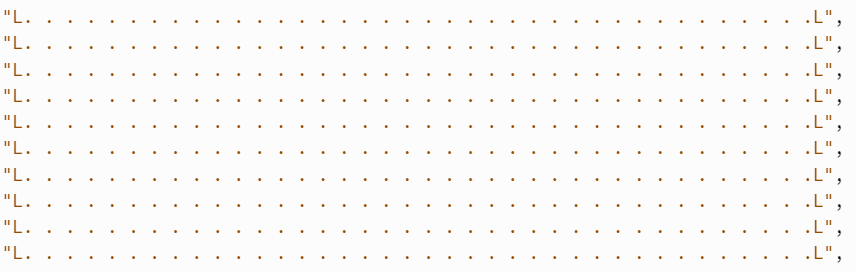

# 2.2.1 Cycle 4 - Rest of the level layout and Camera

### Objectives

I aim to make detailed walls on the top and bottom of the level,The walls will finish the main building blocks for the design for my level.Additionally I will try to get the "camera" to follow the player &#x20;

* [x] Add detailed walls on the top and bottom of the level and make it solid&#x20;
* [x] Add a Floor that fits with the theme of the design
* [x] Camera follows the player&#x20;

### Usability Features

There are no additional usabuility features in this cycle&#x20;

### Key Variables

| Variable Name | Use                                                                      |
| ------------- | ------------------------------------------------------------------------ |
| Wall          | Creates the wall , it divulges the necessary info to create the platform |
| Solid         | turns the wall into a solid so the player can collide                    |
| camPos        | directs the camera into a certain position                               |


### Pseudocode

<pre><code><strong>Loadsprite(floor)
</strong><strong>
</strong><strong>Class Levelconfiguration
</strong><strong> width : 16
</strong><strong> Height : 32
</strong><strong> 
</strong><strong>Class level
</strong><strong> "L..............................L"
</strong><strong> "L..............................L"
</strong><strong>
</strong><strong>
</strong><strong>"." => 
</strong> loadsprite floor()
 area of floor()
 Scale of wall(2)
 layer of wall(background)  
 
</code></pre>

## Development

### Outcome

In this cycle I focused on making the floor and camera follow the player, I used kaboom.js playground as a base for my floor design and wall design , The code in this cycle is very similar to the previous cycle for the walls so there wasnt much of a problem when writing the code I assigned the floor as "." and the top and bottom walls as "w" and "=" respectively at first i made the floor just " " so the gaps in between the level layout in code are the actual floor, each individual space in between the layout was a floor sprite as shown here

<figure><figcaption></figcaption></figure>

But i found that this was inefficient as it was hard to keep track of every sprite of the floor so to make it easier i assigned the floor to "." which not only makes it easier to track every sprite but also lets me gauge where i can add other items onto the level. This is what it looks like&#x20;

<figure><figcaption></figcaption></figure>

The code for the camera to follow the player was relativley simple despite me struggling with finding out how to do it , i found the code on kaboom.js playground&#x20;

```javascript
 loadPedit("floor","sprites/floor.pedit"),


```

### Challenges

One challenge I had was correctly scaling the wall to player and level in general.The sprites of the wall would intertwine with each other and look quite odd so to fix that i had scaled the wall down and make larger gaps in between input the sprite i.e instead of&#x20;

<figure><figcaption></figcaption></figure>

It looks like this:

<figure><figcaption></figcaption></figure>


Even then the sprites are a bit off and the colour sort of stands out compared to the rest of the level , it might be a problenm ill address later on&#x20;


## Testing

### Tests

| Test | Instructions     | What should happen                                        | What happens  | Pass/fail |
| ---- | ---------------- | --------------------------------------------------------- | ------------- | --------- |
| 1    | Run code         | Walls succesfully loaded in and able to be collided with  | as expected   | pass      |
| 2    | Run code         | New character model succesfully loaded in                 | as expected   | pass      |
| 3    | press W, A ,S, D | New charatcer sprite moves properly                       | as expected   | pass      |

### Evidence

<figure><figcaption></figcaption></figure>
